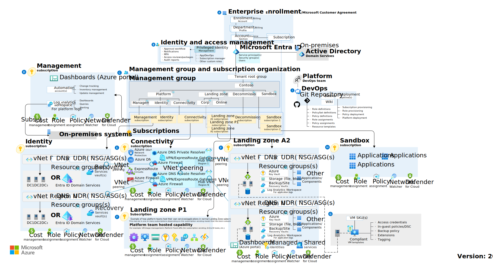

# Architecture

## Components Diagram

```mermaid
graph TB
    %% Nodes
    WebUI["Web UI<br>(React App)<br>VITE/NGINX<br>Azure App Service"]
    WebAPI["Web API<br>Python Flask Orchestrator<br>Private Endpoint Only<br>Azure App Service"]
    VectorAPI["Vector API<br>Python Flask Query Engine<br>Private Endpoint<br>Azure App Service"]
    VectorDB["Vector Database<br>Azure PostgreSQL Flexible Server<br>Private Endpoint"]
    LLM["LLM Model<br>OLLAMA (qwen2.5:0.5b)<br>VM<br>Private Endpoint"]
    Embedder["Document Embedder<br>Python Processor<br>VM<br>Manual Trigger"]
    Client["Client Browser"]
    
    %% NSG nodes
    FNSG["Frontend NSG"]
    ANSG["API NSG"]
    DNSG["Database NSG"]
    VNSG["VM NSG"]
      %% Connections
    Client -->|HTTPS| WebUI
    WebUI -->|NGINX Reverse Proxy<br>to Private Endpoint| WebAPI
    WebAPI -->|Private Endpoint| VectorAPI
    VectorAPI -->|Private Endpoint| VectorDB
    WebAPI -->|Private Endpoint| LLM
    Embedder -->|Populates| VectorDB
    
    %% NSG connections - visual relationship
    FNSG -.->|Secures| FSNET
    ANSG -.->|Secures| ASNET
    DNSG -.->|Secures| DSNET
    VNSG -.->|Secures| VSNET
      %% Styling
    style WebUI fill:#0072C6,color:white,stroke:#0072C6,stroke-width:2px
    style WebAPI fill:#0072C6,color:white,stroke:#0072C6,stroke-width:2px
    style VectorAPI fill:#0072C6,color:white,stroke:#0072C6,stroke-width:2px
    style VectorDB fill:#0072C6,color:white,stroke:#0072C6,stroke-width:2px
    style LLM fill:#0072C6,color:white,stroke:#0072C6,stroke-width:2px
    style Embedder fill:#0072C6,color:white,stroke:#0072C6,stroke-width:2px
    style Client fill:#86B342,color:white,stroke:#86B342,stroke-width:2px
    style FNSG fill:#D83B01,color:white,stroke:#D83B01,stroke-width:2px
    style ANSG fill:#D83B01,color:white,stroke:#D83B01,stroke-width:2px
    style DNSG fill:#D83B01,color:white,stroke:#D83B01,stroke-width:2px
    style VNSG fill:#D83B01,color:white,stroke:#D83B01,stroke-width:2px
    
    %% Grouping with labels
    subgraph VNET["Azure Virtual Network"]
        subgraph FSNET["Frontend Subnet"]
            WebUI
        end
        subgraph ASNET["API Subnet"]
            WebAPI
            VectorAPI
        end
        subgraph DSNET["Database Subnet"]
            VectorDB
        end        subgraph VSNET["VM Subnet"]
            LLM
            Embedder
        end
    end
    
    %% Style the subnets
    style VNET fill:none,stroke:#666,stroke-width:2px
    style FSNET fill:none,stroke:#666,stroke-width:1px,stroke-dasharray:5 5
    style ASNET fill:none,stroke:#666,stroke-width:1px,stroke-dasharray:5 5
    style DSNET fill:none,stroke:#666,stroke-width:1px,stroke-dasharray:5 5
    style VSNET fill:none,stroke:#666,stroke-width:1px,stroke-dasharray:5 5
```

## Flow

```mermaid
sequenceDiagram
    participant Client as Client
    participant WebUI as Web UI
    participant WebAPI as Web API
    participant VectorAPI as Vector API
    participant VectorDB as Vector DB
    participant LLM as LLM Model
    
    Note over WebUI,LLM: All components within Azure VNET with respective NSGs
    
    Client->>WebUI: User query
    WebUI->>WebAPI: Forward query
    WebAPI->>VectorAPI: Process query
    VectorAPI->>VectorDB: Keyword search
    VectorDB-->>VectorAPI: Search results
    VectorAPI->>VectorDB: Semantic search
    VectorDB-->>VectorAPI: Search results
    VectorAPI->>VectorAPI: Rank & combine results
    VectorAPI-->>WebAPI: Return ranked results
    WebAPI->>LLM: Generate response
    LLM-->>WebAPI: RAG response
    WebAPI-->>WebUI: Return response
    WebUI-->>Client: Display to user
```

## AI Models Configuration

### Vector API Models

| Purpose | Model Name | Description |
|---------|------------|-------------|
| Cross Encoder | `cross-encoder/ms-marco-MiniLM-L-2-v2` | Used for re-ranking search results |
| Embeddings | `all-mpnet-base-v2` | Used for generating vector embeddings |
| Keyword Processing | `all-mpnet-base-v2` | Used for keyword extraction and processing |

### LLM Configuration

| Service | Model | Description |
|---------|-------|-------------|
| OLLAMA | `qwen2.5:0.5b` | Lightweight LLM for text generation and RAG responses |

## Deployment Environment

The EPIC.search application is currently deployed in the BC Gov Landing Zone **Test** subscription/VWAN environment only. Future plans include deployment across the complete environment structure:

| Environment | Status | Description |
|-------------|--------|-------------|
| DEV | Planned | Development environment for building and testing new features |
| TEST | Deployed | Current deployment environment for testing and validation |
| PROD | Planned | Production environment for end-user access |
| TOOLS | Planned | Supporting tools and utilities for the application |

### BC Gov Landing Zone

The application is built on the BC Government Landing Zone architecture, which provides a standardized approach to deploying applications in the Azure cloud environment.

For more information about the BC Government Landing Zone architecture, please refer to the [BC Gov Landing Zone Documentation](https://developer.gov.bc.ca/docs/default/component/public-cloud-techdocs/azure/get-started-with-azure/bc-govs-azure-landing-zone-overview/)
